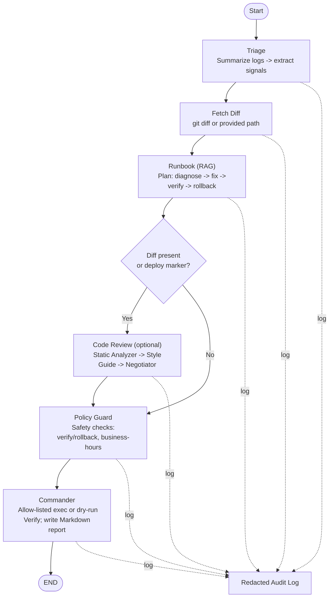

# OpsBridge (The Runbook Copilot × PR Review Mesh)

## What it is?
OpsBridge is a system that helps you handle incidents end-to-end:
1. Reads recent logs and summarizes symptoms (Triage).
2. Looks up runbooks with a local RAG index and creates a simple plan.
3. If it looks like a bad deploy, it jumps into code review (quick static checks + style-guide notes) and suggests revert / hotfix / no-code-issue.
4. Runs only allow-listed commands (or dry-runs by default) and writes a clean incident report to incidents/.
5. Keeps a redacted audit log of tool calls in audit/.

## Why this exists?
Teams hit the same wall over and over during incidents:
1. On-call gets paged and Logs are noisy and you’re guessing where to look first.
2. Runbooks exist but they’re scattered, stale, or written for last year’s version.
3. It might be the deploy. Now you jump tools: pull the diff, skim changes, run a linter, check the style guide, ask “rollback or hotfix?”.
4. Risky execution. Even if you know what to do, you want guardrails: no surprise rm -rf, business-hours rules, two-person approval.
5. Paperwork later. After the fire is out, someone still has to write the incident report—timelines, steps, outputs, decisions.

This fragmentation is why incidents take longer than they should. Most teams already have the parts (logs, runbooks, repo, CI, wiki). The missing piece is the glue that guides you through a clean, auditable path—especially when incidents are actually caused by recent code changes.

## What OpsBridge does?
OpsBridge stitches the flow together using a small agent-to-agent pipeline:
1. Triage: Reads recent log lines, keeps the useful bits (e.g., 5xx and deploy markers), and writes a short symptom summary.
2. Runbook lookup (RAG): Searches your local runbooks and drafts a simple plan (diagnose → fix → verify → rollback if needed).
3. Code-review bridge: If there’s a diff (or the logs mention a deploy), it does quick static checks, pulls style-guide rules, and proposes: revert, hotfix, or no-code-issue—then adds that action to the plan.
4. Policy Guard: Checks basic safety rules (e.g., verification is required; restart needs rollback; block restarts during business hours). If something violates policy, it blocks approval and documents the reason.
5. Commander: Runs only allow-listed commands (or dry-runs by default), performs a verify step, and writes a clean incident report to incidents/. Every tool call is logged to audit/ with secrets redacted.

## How it works?
I run a small LangGraph that passes a shared state through agents:
* Triage summarizes logs.
* Runbook builds the plan from your docs (local RAG).
* If there’s a diff/deploy, the code-review path may prepend a revert/hotfix step.
* Policy Guard checks simple rules.
* Commander executes only allow-listed commands (or dry-runs), verifies, and writes the Markdown report.
* An audit log records each tool call.

## Who this helps?
* On-call engineers who want a confident “first 10 minutes” routine.
* Platform teams who need safer execution and automatic reports.
* Leads who want a clear story: “what happened, what we did, why we chose rollback.”
* Regulated orgs that need an audit trail without extra busywork.

## Roadmap
1. Runbook Linter & Drift Detector: dry-run diagnostics weekly and open a review file if steps fail.
2. Two-person approval: real second approver + proper OPA/Conftest policy integration.
3. Signal De-noiser v2: smarter ranking / small classifier for noisy logs.
4. Change Correlator: map incident commit, feature flag, deploy window.
5. Auto-postmortem: richer timeline, charts, and wiki publishing.
6. Sandboxed execution: run commands in isolated containers; stricter allowlist per environment.
7. Impacted-tests selector: run only the tests affected by the diff.
8. Git MCP wiring: pull real diffs via MCP instead of shell calls.
9. Auth & RBAC: API keys/roles, better observability, and CI tests.

## Quickstart (CLI)

> Prereqs: Python 3.11+, pip
* Install:

  ```
  pip install -r requirements.txt
  ```
* Create .env:

  ```
  LLM_MODEL=groq:gemma2-9b-it
  GROQ_API_KEY=your_groq_api_key_here
  APPROVE=false
  ```
* Build the local RAG index:
  ```
  python rag/ingest.py
  ```
* Simulate some faults:
  ```
  bash scripts/make_faults.sh
  ```
* Run once (safe, dry-run):
  ```
  python app.py
  ```
* See artifacts:
  ```
  ls incidents
  tail -n 10 audit/audit.log
  ```
* Approved run:
  ```
  python app.py --approve
  ```
* Trigger code-review path:
  ```
  python app.py --diff samples/diff.patch
  ```

### Run as an API
* Start the server:
  ```
  uvicorn server_fastapi:app --host 0.0.0.0 --port 8000
  ```
* Kick off a run:
  ```
  curl -X POST http://localhost:8000/run \
  -H "Content-Type: application/json" \
  -d '{"service":"toy-web","approve":false,"diff_path":"samples/diff.patch"}'
  ```
> Artifacts appear in incidents/ and audit/.

### Docker
* Build:
  ```
  docker build -t opsbridge:demo .
  ```
* Run the API server:
  ```
  docker run --rm -p 8000:8000 --env-file .env \
  -v "$(pwd)/incidents:/app/incidents" \
  -v "$(pwd)/audit:/app/audit" \
  opsbridge:demo
  ```
* Trigger a run from your host:
  ```
  curl -X POST http://localhost:8000/run -H "Content-Type: application/json" -d '{}'
  ```
## Safety notes
* Default mode is dry-run.
* Execution uses a strict allowlist (edit in agents/utils.py).
* Outputs and arguments are redacted in audit/audit.log.
* The current policy guard is a stub; treat this as a demo, not production.

### Repo Link: https://github.com/jainshauryaj/OpsBridge
